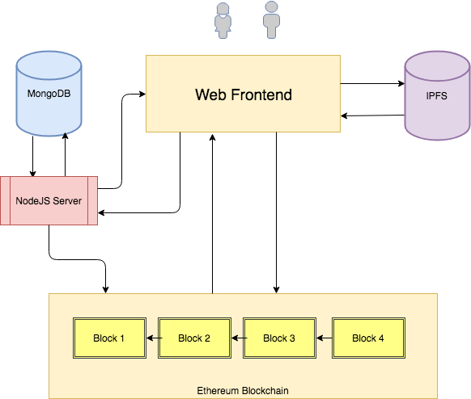
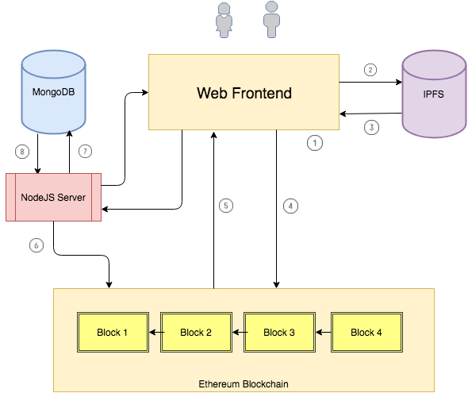
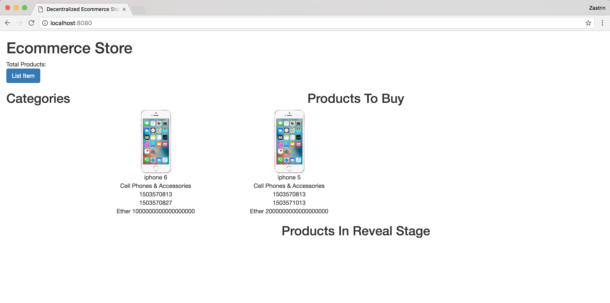

# 1，引言

## 1.1 欢迎

### 以太坊和 IPFS 上的去中心化 eBay

欢迎来到课程去中心化的 eBay。这是一个中级课程，你将会构建一个类似 eBay 的商场，卖家可以在这里拍卖售出他们的产品，买家也可以出价购买。

所有的商业逻辑和数据将会放在以太坊区块链上，这使得它是一个完全去中心化的应用。在以太坊上存储图片和大文本十分昂贵（由于 EVM 的限制，有时甚至是不可能）。为了解决这个问题，我们将会把图片和大文本存储在 IPFS(Inter Planetary File System)。在本课程中，我们将会学习更多有关 IPFS 的知识，并把它集成到应用中。

## 1.2 为什么要去中心化？

在开始构建我们的应用之前，非常值得花一分钟时间理解为什么要在像以太坊这样的去中心化平台上搭建一个商场。

eBay 已经获得了巨大成功，因为它使得买卖都相当便利。在互联网成为主流之前，人们只能在小范围内，或向邻居买卖商品。当越来越多的人使用互联网，出现了像 eBay 这样的公司，无论来自世界的任何一个地方，你都可以在网上买卖商品。无论是商家还是消费者，eBay 都是极好的。

尽管 eBay 方便了大家，也改善了贸易和经济，它也有一些缺点。

  - 1，参与的商家受制于公司。在任何时候，公司可以自行决定在它们的平台上对商家进行封号，而如果商家恰好依存于此，那么就是一个巨大的打击。

  - 2，商家陈列商品要交费，卖出商品也要交佣金。收费本身并没有错，毕竟 eBay 提供了服务。但是，陈列费有时太高了，这导致商家最后盈利很少，或是将成本转嫁到消费者身上。

  - 3，商家/消费者无法拥有自身数据。评论，购买历史等等所有数据都为公司所有。比如，如果一个商家想要换一个提供商，想要导出它原来的评论或是其他数据都非常不容易，或者几乎不可能。

在以太坊上构建商场就解决了这些问题。商家的账户不会被封，数据是公开的，所以很容易导出数据，相对于中心化公司，交易费也会低得多。

## 1.3 项目细节

现在你已经知道为什么以及我们要构建的应用是什么，让我们大致来看一下在这个项目中将要实现的所有功能：

  - 1，列出商品。商场应该能够让商家陈列商品。我们会实现让任何人免费陈列商品的功能。为了便于查询，我们会将数据同时存在链上和链下的数据库。

  - 2，将文件放到 IFPS： 我们会实现一个将图片和产品介绍（大文本）上传到 IPFS 的功能。

  - 3，浏览产品：我们会实现基于目录，拍卖时间等过滤和浏览商品的功能。

  - 4，拍卖：跟 eBay 一样，我们会实现 Vickery 拍卖对商品出价。与中心化应用不同，以太坊上的一切都是公开的，我们的实现将会有些不同。我们的实现将会类似于 ENS 的工作方式。

  - 5，托管合约（Escrow Contract）：一旦出价结束，商品有了赢家以后，我们会创建在买方，卖方和一个任意第三方的托管合约。

  - 6，2/3 签名：我们会加入防欺诈保护，方式为实现 2/3 多重签名，即三个参与者有两个同意才会将资金释放给卖方，或是将资金返还给买方。

## 1.4 先修课程

为了成功地完成课程，你应该对以下语言/技术有几本理解：

  - 1，Solidity：合约将会使用 solidity 编程语言。第一节课没有覆盖的内容(以太坊上的投票)都会这里深入合约时进行解释。如果你还没有完成第一节课，你必须至少写过一两个简单的 solidity 合约。对 truffle 有基本的了解将会十分有帮助。

  - 2，HTML/CSS: 相比投票课程，本课程将会有更多的 HTML 和 CSS 代码。你应该对使用 HTML/CSS 构建前端有基本的了解。

  - 3，Javascript: 我们将会进一步使用 JavaScript。它会在服务端将数据保存到数据库，查询数据库并将结果返回给前端。web3.js 用于前端与区块链交互。为了适用各种背景的学生，我们已经保持 JavaScript 代码尽可能地简单。

  - 4，Database: 在这节课，我们会用 MongoDB 在链下保存产品信息。无须特定了解 MongoDB ，但是基本的数据库知识还是必要的。

# 2，实现计划 

## 2.1 应用架构

在开始实现代码之前，先来看一下在本课程我们将要构建的 Dapp 的架构。

  - 1，Web 前端：web 前端由 HTML，CSS 和 JavaScript 组合而成（大量使用了 web3js）。用户将会通过这个前端应用于区块链，IPFS 和 NodeJS 服务器交互。

  - 2，区块链：这是应用的核心，所有的代码和交易都在链上。商店里的所有商品，用户的出价和托管合约都在链上。

  - 3，MongoDB：尽管产品存储在区块链上，但是通过查询区块链来显示产品，应用各种过滤（比如只显示某一类的产品，显示即将过期的产品等等）。我们会用 MongoDB 数据库来存储商品信息，并通过查询 MongoDB 来显示产品。

  - 4，NodeJS 服务器：这是后端服务器，前端通过它与区块链通信。我们会给前端暴露一些简单的 API 从数据库中查询和检索产品。

  - 5，IPFS: 当一个用户在商店里上架一个商品，前端会将产品文件和介绍上传到 IPFS，并将所上传文件的哈希存到链上。 
  
  架构图：
  
  

## 2.2 应用流程图

为了理解我们在上一节谈到的那些组件，让我们来看看一下用户上架一个商品的流程是怎样的。

- 1，当用户输入产品细节（名字，起价，图片，描述信息等等）并点击保存后，web 前端将会包含一个 HTML 表格。(1)

- 2，web 前端将产品图片和介绍上传到 IPFS，并返回这些所上传内容的链接。你可以在 这里 查看 IPFS 的链接示例。(2) 和 (3)

- 3，web 前端然后会调用合约将产品信息和 IPFS 链接存储到链上。当合约成功地将产品加入到区块链，就会触发一个事件。事件包含了所有的产品信息。(4)和(5)

- 4，NodeJS 服务器用来监听这些事件，当事件被合约触发时，服务器读取时间内容并将产品信息插入到 MongoDB。(6), (7) 和 (8)

流程图：



## 2.3 实现步骤

1，我们首先会用 solidity 和 truffle 框架实现合约，将合约部署到 ganache 并通过 truffle 控制台与合约进行交互。

2，然后我们会学习 IPFS，安装并通过命令行与它交互。

3，后端实现完成后，我们会构建前端与合约和 IPFS 进行交互。我们也会在前端实现出价和显示拍卖的功能。

4，我们会安装 MongoDB 并设计存储产品的数据结构。

5，一旦数据库启动运行，我们会实现 NodeJS 服务端代码，以监听合约事件，并记录向控制台的请求。我们然后会实现向数据库中插入产品的代码。

6，我们将会更新前端从数据库而不是从区块链查询产品。

7，我们会实现托管合约以及对应的前端，参与者可以从来向买方/买房释放或撤回资金。

# 3，以太坊合约

## 3.1，Truffle项目

要做的第一件事就是启动 truffle 项目。按照下面的指示创建 truffle 项目。

在接下来的几节，我们将会实现合约。下面是将要在合约中实现的几个用户场景：

1，用户应该能够将产品添加到区块链。我们首先会定义想要一个在链上存储的所有产品细节的结构。

2，实现将产品加入区块链的函数。

3，实现出价（bid）的功能，任何都可以对商品提交一个不公开的竞价。

4，实现证明出价金额的公开函数（reveal function）

```sh
$ mkdir ebay_dapp
$ cd ebay_dapp
$ truffle unbox webpack
$ rm contracts/ConvertLib.sol contracts/MetaCoin.sol
```

## 3.2，电子商务产品

>在 contracts 目录下创建一个新的文件 EcommerceStore.sol，将代码内容添加到里面。下面是合约细节。

### 存储产品和元数据的数据结构

1，struct Product: 当用户想要在商店列出一个商品时，他们必须要输入关于产品的所有细节。我们将所有的产品信息存储在一个 struct 里面。struct 里面的大部分元素都应当清晰明了。你应该能够注意到有两个元素 imageLink 和 descLink。除了在链上存储产品图片和大的描述文本，我们还会存储 IPFS 链接（下节会有更多介绍），当我们要渲染网页时，会从这些链接中获取这些细节。

2，enum: 很多编程语言都有枚举（enum）的概念。它是一个用户定义类型，可以被转换为整型。在我们的案例中，我们会将产品的条件和状态存储为枚举类型。所以，Open 的 ProductStatus 在链上存储为 0，已售出则为 1，如此类推。它也可以使得代码更加易读（相比于将 ProductStatus 声明为 0，1，2）

3，productIndex: 我们会给加入到商店的每个商品赋予一个 id。这就是一个计数器，每当一个商品加入到商店则加 1 。

4，productIdInStore: 这是一个 mapping，用于跟踪哪些商品在哪个商店。

5，stores mapping: 任何人都可以免费列出商店里的产品。我们通过 mapping 跟踪谁插入了商品。键位商家的账户地址，值为 productIndex 到 Product 结果的 mapping。

比如，现在商店还没有任何商品。账户地址为(0x64fcba11d3dce1e3f781e22ec2b61001d2c652e5) 的用户向店里添加了一个 iPhone，他想要卖掉这个 iPhone。我们的 stores mapping 现在就会是：0x64fcba11d3dce1e3f781e22ec2b61001d2c652e5 => {1 => "struct with iphone details"}

用 truffle compile 编译合约，在继续之前请确保没有任何问题。

>debug 合约里的问题可能非常麻烦。我们推荐每一节完成后都编译一下，以便于早发现，早治疗。

`EcommerceStore.sol`

```
pragma solidity ^0.4.13;

contract EcommerceStore {
 enum ProductStatus { Open, Sold, Unsold }
 enum ProductCondition { New, Used }

 uint public productIndex;
 mapping (address => mapping(uint => Product)) stores;
 mapping (uint => address) productIdInStore;

 struct Product {
  uint id;
  string name;
  string category;
  string imageLink;
  string descLink;
  uint auctionStartTime;
  uint auctionEndTime;
  uint startPrice;
  address highestBidder;
  uint highestBid;
  uint secondHighestBid;
  uint totalBids;
  ProductStatus status;
  ProductCondition condition;
 }

 constructor() public {
  productIndex = 0;
 }
}
```

## 3.3，向商店添加商品

向链上添加并检索产品

既然我们已经定义了产品的数据结构，让我们将产品添加到区块链并进行检索。建议你尝试按照下面的指引实现函数，下面代码实现仅作参考之用。

1，新建一个叫做 addProductToStore 的函数，参数为构建 product 结构的所需内容（除了出价相关的变量）。

2，与上一节讨论的 productIndex 类似，计数加 1。

3，使用 require 来验证 auctionStartTime 小于 auctionEndTime。

4，初始化 Product 结构，并用传入函数的参数进行填充。

5，将初始化后的结构存储在 stores mapping。

6，同时在 productionIdInStore mapping 中记录是谁添加了商品。

7，创建一个叫做 getProduct 的函数，它将 productId 作为一个参数，在 stores mapping 中查询商品，返回商品细节，

>每一轮拍卖我们会以秒存储开始和结束时间。

>startPrice 存储的单位为 wei。

如果你留心的话，我们在两个函数中都用了一个叫做 memory 的关键字来存储商品。之所以用这个关键字，是为了告诉 EVM 这个对象仅作为临时变量。一旦函数执行完毕，该变量就会从内存中清除。

```
function addProductToStore(string _name, string _category, string _imageLink, string _descLink, uint _auctionStartTime,
  uint _auctionEndTime, uint _startPrice, uint _productCondition) public {
  require (_auctionStartTime < _auctionEndTime);
  productIndex += 1;
  Product memory product = Product(productIndex, _name, _category, _imageLink, _descLink, _auctionStartTime, _auctionEndTime,
                   _startPrice, 0, 0, 0, 0, ProductStatus.Open, ProductCondition(_productCondition));
  stores[msg.sender][productIndex] = product;
  productIdInStore[productIndex] = msg.sender;
}

function getProduct(uint _productId) view public returns (uint, string, string, string, string, uint, uint, uint, ProductStatus, ProductCondition) {
  Product memory product = stores[productIdInStore[_productId]][_productId];
  return (product.id, product.name, product.category, product.imageLink, product.descLink, product.auctionStartTime,
      product.auctionEndTime, product.startPrice, product.status, product.condition);
}
```

运行`truffle compile`。

## 3.4，控制台交互

如果你还没有启动 ganache，启动 ganache 并部署合约，看一下你是否能与合约交互。

1，打开 terminal 启动 ganache。

2，像下面这样编辑 migration 文件，保存并将合约部署到区块链。

3，启动 truffle 控制台并向区块链添加一个商品。你可以给图片和描述链接随机输入一些内容（在实现 IPFS 的相关功能呢后，我们会来改进这一点）。

4，通过 product id 检索你插入的商品（由于这是你添加的第一个商品，所以 product id 将会是 1）。

代码：

`terminal 1`

```
$ npm install -g ganache-cli
$ ganache-cli
```

`terminal 2`

将`migrations/2_deploy_contracts.js`修改为：

```
var EcommerceStore = artifacts.require("./EcommerceStore.sol");

module.exports = function(deployer) {
 deployer.deploy(EcommerceStore);
};
```

然后运行

```
$ truffle migrate
$ truffle console
```

如果运行`truffle migrate`报错，那么需要修改`truffle.js`中的地址为本地跑起来`ganache-cli`的地址。

例如：

```js
module.exports = {
  networks: {
    development: {
      host: "127.0.0.1",
      port: 8545,
      network_id: "*" // Match any network id
    }
  }
};
```

运行`truffle console`以后，进入控制台，运行以下命令。

```
truffle(development)>  amt_1 = web3.toWei(1, 'ether');
'1000000000000000000'
truffle(development)>  current_time = Math.round(new Date() / 1000);
truffle(development)>  EcommerceStore.deployed().then(function(i) {i.addProductToStore('iphone 6', 'Cell Phones & Accessories', 'imagelink', 'desclink', current_time, current_time + 200, amt_1, 0).then(function(f) {console.log(f)})});
truffle(development)>  EcommerceStore.deployed().then(function(i) {i.getProduct.call(1).then(function(f) {console.log(f)})})
```

## 3.5，eBay拍卖

### 拍卖是如何工作的

我们成功地向区块链添加了一个产品。现在，用户应该能够像在 eBay 上一样对你的商品进行出价。eBay 有几种不同类型的拍卖，比如增量竞价（incremental bidding），自动竞价（automatic bidding）等等。下面是 eBay 自动竞价的一个工作案例：

比如说一个商品标价为 10 美元。只要高于 10 美元，你可以任意出价：

1，Alice 出价 10.50 美元。那么，她就是拍卖的一个有力竞争者。

2，Mary 现在看到的出价是 10.50 美元，但是她出价 15 美元。尽管她出价 15 美元，但是 eBay 显示的最高价格为 10.75 美元。虽然 Alice 输掉了出价，但是她可以再次竞价。

3，John 现在看到的出价是 10.75 美元，然后他出价 12 美元，但是 eBay 会代表 Mary 出价（因为 Mary 已经出价 15 美元），并将价格提升到 12.25 美元（比 John 的出价高了 0.25 美元）。所以，John 输掉了竞价。

4，现在 Alice 打算出价 17 美元。因为 Alice 的出价高于 Mary，eBay 将出价调整到 15.25 美元（比 Mary 的出价高 0.25 美元）。Mary 输掉了竞价（如果她想的话可以再次出一个更高的价）

5，没有人再出价了，所以 Alice 赢得了拍卖。即使 Alice 出价 17 美元，但是她只需要支付 15.25 美元。

## 3.6，暗标拍卖

我们刚刚学的拍卖类型叫做 Vickery Auction。

任何人都可以监控交易来观察是否有其他人为一个商品出价。回到上一节的例子，当 Mary 出价 15 美元时，除了 Mary 和 eBay 没有人知道她到底出价多少。但是在以太坊上，每个人都会知道她出价多少，这实际上就会变成一个公开拍卖。为了解决这个问题，我们会使用一个稍微不同于 Vickery auction 的形式，出价者提交一个经过加密的竞价，这样就不会有人知道出价到底是多少。在拍卖结束的时候，所有参与竞价的人都出示自己的出价，大家就可以看到每个人都出价多少。合约会验证密封出价与公开出价是否一致，然后决定最终的赢家。赢家支付金额为第二高的出价。这与 ENS 的拍卖非常类似。

另一个非常不一样的地方是，在 eBay 中，当你出价时，你提交的是赢得竞价的金额，但是实际支付金额并不是所提交的出价。我们的情况则不同，当用户出价的时候必须同时发送 ETH。在以太坊中，所谓出价者就是账户地址而已，如果你通过支付来出价，就无法保证最高出价者会实际赢得拍卖。当竞价结束，所有输掉竞价的人将会收回各自出价的 ETH。

还是上一节的例子，让我们来看一下它在区块链上到底是如何工作的。

>Alice 为商品出价 10.50 美元

在我们的系统中，如果 Alice 想要出价 10.50 美元，她将会对出价进行隐藏 sha3($10.50, "secretstring")，产生一个哈希 比如说 3fc3ac1afb93b6c29dc1a7d03cbff392ab89638475ed0fe7a3923facfe1dab67（我们会在下一节复习哈希的有关细节）。然后她将这个字符串发送出去，同时发送价值 15 美元的 ETH。看到这笔交易的任何人就都知道了她发送了 15 美元，但是没有人知道她只出价 10.50 美元。

>Mary 现在看到出价是 10.50 美元，但是她送出了 15 美元。

在这种情况下，Mary 并不知道 Alice 出价 10.50 美元。她知道 Alice 送出了 15 美元。如果 Mary 想要出价 15 美元，她可以对 sha3($15, "marysecretstring") 进行哈希，并发送哈希后的字符串，同时还有 15 美元或者更多的 ETH。

类似地，每个人都可以对想要购买的商品进行出价。

注意，用户可能会发送一个小于实际出价的数额来迷惑其他人。比如：Alice 出价 sha3($30, "secretstring")，但是实际只给合约转了 20 美元。在这种情况下，当她揭示出价时，合约会将这些钱归还回去，因为这是一个无效的出价。

>John 现在看到目前的出价是 10.75 美元，而他出价 12 美元

在这种情况下，John 仅出价 12 美元，因为这就是它愿意支付的金额。

>现在 Alice 决定出价 17 美元

尽管 Alice 已经出价了一次，她仍然可以再次出价。失败的任何报价，Alice 都会取回自己的钱。

## 3.7，揭示报价

一旦拍卖结束，所有的出价者都必须揭示各自报价。为了揭示报价，出价者必须向合约发送他们出价的金额和 secret string（他们用 secret string 对出价进行了哈希）。合约通过将报价金额与 secret string 进行组合构造出哈希后的报价，然后与出价者之前所发送的哈希后的字符串进行匹配。如果匹配成功，则出价有效。否则出价无效，合约会返还相应的资金。

还是回到之前的例子，来看一下揭示报价是如何工作的。

### Alice 揭示报价

Alice 通过向合约发送 10.50 美元和 “secretstring” 来揭示她的报价。合约使用同一个算法来生成哈希。在这个例子中，所生成的哈希会与 Alice 所发送的3fc3ac1afb93b6c29dc1a7d03cbff392ab89638475ed0fe7a3923facfe1dab67 一样。由于这是一个有效出价并且 Alice 发送了 15 美元，合约会记录它为有效出价，并将 15 - 10.5 = 4.5 美元返还给 Alice。

### Mary 揭示报价

类似地，Mary 也要揭示她的出价。因为她出价 15 美元，她就是最高的出价者。合约会替换掉 Alice，Mary 成为最高的出价者，Alice 成为第二高的出价者。因为 Alice 没有赢得竞价，所以她会拿回自己所有的钱。

### John 揭示报价

John 仅出价 12 美元。当揭示报价时，因为 John 输掉了竞价所以他会立刻收到返还的资金。

在本例中， Mary 赢得竞价，并支付 12 美元（第二高的报价）。

## 3.8，合约代码

现在我们已经知道出价和揭示出价是如何工作了。下面让我们来实现这些功能。

我们需要有一种途径来存储用户的出价。让我们来创建一个 struct 保存出价信息。注意 struct 里面的 value 字段是出价者实际发送 ETH 的数量，而不是当前实际出价的数量。当前出价的数量被加密了。只有发送的数量是已知的，它会被用于填充 value 字段。

为了方便地查询用户给哪个商品出价，出价多少。让我们给 product struct 加入一个 mapping mapping (address => mapping (bytes32 => Bid)) bids;。键为出价者的地址，值为哈希后的出价字符串到 bid struct 的 mapping。

`Bid Struct`

```
struct Bid {
  address bidder;
  uint productId;
  uint value;
  bool revealed;
}
```

`Product Struct`

```
struct Product {
  ....
  ....
  mapping (address => mapping (bytes32 => Bid)) bids;
}
```

### 出价

bid 函数有两个参数，product id 和加密后的 bid 字符串。bid 函数本身非常直观。我们从 stores mapping 检索产品，构建 bid struct 并把它加入到 mapping（我们上面刚刚初始化了）。我们有一些验证（require 语句）也很直观。你会注意到代码里的关键词 now。它仅仅是当前块的时间戳，也就是，当 bid 函数被调用时，表明一笔交易被创建。这笔交易被矿工打包到块里。每个块都有一个对应的时间戳（用来告诉你这个块被挖出来的时间）。now 就等同于那个时间戳。

在上两节，我们谈到了对 bid 进行哈希。sha3 是一个密码学上的哈希函数，对于任何长度的任意字符串，它都可以生成一个固定长度的唯一字符串。所生成的字符串对于给定的任意字符串都是独一无二的，也就是说，没有两个任意字符串能够通过 sha3 哈希算法生成一样固定长度的哈希。

让我们来看一下为什么这对我们的场景十分有用（生成密封的出价）。为了生成一个密封出价，我们使用了 ethereumjs-util library's sha3 function。如果 Alice 想要生成一个出价，她只需要调用 sha3 函数，传入她打算出价的数量和 secret。

```js
sha3("10.5" + "secretstring").toString('hex') => c2f8990ee5acd17d421d22647f20834cc37e20d0ef11087e85774bccaf782737
```

这是传入 bid() 函数的 bytes32 字符串。任何看到该字符串的人都不知道 Alice 的出价是 10.5。

`Bid function`

```js
function bid(uint _productId, bytes32 _bid) payable public returns (bool) {
  Product storage product = stores[productIdInStore[_productId]][_productId];
  require (now >= product.auctionStartTime);
  require (now <= product.auctionEndTime);
  require (msg.value > product.startPrice);
  require (product.bids[msg.sender][_bid].bidder == 0);
  product.bids[msg.sender][_bid] = Bid(msg.sender, _productId, msg.value, false);
  product.totalBids += 1;
  return true;
}
```

### 揭示出价

revealing 函数稍显复杂。为了更好地理解代码，让我们首先来捋一下逻辑。揭示出价就是要告诉合约你出价了多少。方式就是将的 secret string 和你打算出价的数量发送给合约。合约将同样的 sha3 算法应用于出价数量和 secret，并检查所生成的哈希是否在 bids mapping 里面。当执行检查的时候，可能会出现以下场景：

1，没有找到相关的哈希。这意味着用户尝试揭示不曾出价过的数量。在这种情况下，仅抛出一个异常（revealBid 函数的第 6 行）

2，出价数量小于发送数量：比如用户出价 10 美元，但是只发送了 5 美元。因为这是无效的，所以我们只需要将这 5 美元返回给用户即可。

3，出价数量大于等于发送数量：这是一个有效出价。现在我们会检查是否应该记录此次出价。

4，首次揭示：如果这是第一个有效的出价揭示，我们会把它记录为最高出价，同时记录是谁出的价。我们也会将第二高的出价设置为商品的起始价格（如果没有其他揭示报价，就由这个用户支付起始价格。还记得赢家总是支付第二高的价格吗？）。（Lines 15 - 19）

5，更高的出价：如果用户揭示了出价，并且他们的出价高于现有所揭示的最高出价，我们将会记录该出价者，将其出价记录为最高出价，并设置第二高的出价为旧的出价数量。（Lines 21 - 25）

6，更低的出价：如果出价比最高出价要低，这是一个会失败的出价。但是我们也会检查它是否低于第二高的出价。如果是的话，只需要返还资金即可，因为他们已经输掉了竞价，否则将该出价设置为第二高的出价。

在所有情况中，我们会返还发送数量与实际出价的差额，也就是，如果 Alice 出价 10 美元，但是发送了 15 美元，在揭示出价以后，将会返回给 Alice 5 美元。

### getter 函数

让我们也实现两个简单的 getter 函数，分别返回最高出价者信息和一个商品的总出价。这些信息将会用于在网页显示出价信息，同时为了有助于在 truffle 控制台进行测试。

`Reveal function`

```js
function revealBid(uint _productId, string _amount, string _secret) public {
 Product storage product = stores[productIdInStore[_productId]][_productId];
 require (now > product.auctionEndTime);
 bytes32 sealedBid = sha3(_amount, _secret);

 Bid memory bidInfo = product.bids[msg.sender][sealedBid];
 require (bidInfo.bidder > 0);
 require (bidInfo.revealed == false);

 uint refund;

 uint amount = stringToUint(_amount);

 if(bidInfo.value < amount) {
  // They didn't send enough amount, they lost
  refund = bidInfo.value;
 } else {
  // If first to reveal set as highest bidder
  if (address(product.highestBidder) == 0) {
   product.highestBidder = msg.sender;
   product.highestBid = amount;
   product.secondHighestBid = product.startPrice;
   refund = bidInfo.value - amount;
  } else {
   if (amount > product.highestBid) {
    product.secondHighestBid = product.highestBid;
    product.highestBidder.transfer(product.highestBid);
    product.highestBidder = msg.sender;
    product.highestBid = amount;
    refund = bidInfo.value - amount;
   } else if (amount > product.secondHighestBid) {
    product.secondHighestBid = amount;
    refund = bidInfo.value;
   } else {
    refund = bidInfo.value;
   }
  }
 }
 product.bids[msg.sender][sealedBid].revealed = true;

 if (refund > 0) {
  msg.sender.transfer(refund);
 }
}
```

`Getter & Helper functions`

```js
function highestBidderInfo(uint _productId) view public returns (address, uint, uint) {
  Product memory product = stores[productIdInStore[_productId]][_productId];
  return (product.highestBidder, product.highestBid, product.secondHighestBid);
}

function totalBids(uint _productId) view public returns (uint) {
  Product memory product = stores[productIdInStore[_productId]][_productId];
  return product.totalBids;
}

function stringToUint(string s) pure private returns (uint) {
  bytes memory b = bytes(s);
  uint result = 0;
  for (uint i = 0; i < b.length; i++) {
    if (b[i] >= 48 && b[i] <= 57) {
      result = result * 10 + (uint(b[i]) - 48);
    }
  }
  return result;
}
```

然后，

```sh
$ truffle compile
$ truffle migrate
```

## 3.9，控制台交互

我们会用 ethereumjs-util 库来生成出价的哈希。首先来安装这个库。将库添加到 package.json 并安装。

你已经在 ganache 部署了合约的第一个版本。你可以重启 ganache 并运行 truffle migrate，或者传入 --reset 选项来重新部署合约。

1, 让我们首先向区块链插入一个商品（拍卖结束时间从现在算起 200 秒）

2, 我们已经有了 10 个测试账户，所以让我们从不同账户出价几次。

当你对商品出价以后，使用 web3.eth.getBalance 检查 accounts[0] 和 accounts[1] 的余额。你会注意到它们的余额大概是 97 ETH 和 96 ETH。他们打算出价 2 ETH 和 3 ETH，但是分别发送了 3 ETH 和 4 ETH。如果代码如期工作，当我们揭示出价时，差价应该返还给这些账户。

1, 我们会等待直到拍卖结束（在本例中我们已经设置结束时间为现在起 200 秒），然后揭示所有出价。

2, 我们将会使用 getter 方法来查看是谁赢得了拍卖。

当执行 highestBidderInfo 函数，你应该看到 accounts[2] 为最高出价 3 ETH 的出价者（赢家），第二高的出价是 2 ETH。

此时，所有失败的出价者将会收到返回的出价资金。赢家的出价数量仍然在合约里。在托管服务一节，我们将会添加将 ETH 从合约转移到单独的托管合约的功能。

```js
"devDependencies": {
  ....
  ....
  "ethereumjs-util": "5.1.2"
}
```

```sh
$ npm install
$ truffle migrate --reset
$ truffle console
```

```js
truffle(development)>  amt_1 = web3.toWei(1, 'ether');
'1000000000000000000'
truffle(development)>  current_time = Math.round(new Date() / 1000);
truffle(development)>  EcommerceStore.deployed().then(function(i) {i.addProductToStore('iphone 6', 'Cell Phones & Accessories', 'imagelink', 'desclink', current_time, current_time + 200, amt_1, 0).then(function(f) {console.log(f)})});
truffle(development)>  EcommerceStore.deployed().then(function(i) {i.getProduct.call(1).then(function(f) {console.log(f)})})
truffle(development)>  Eutil = require('ethereumjs-util');
truffle(development)>  sealedBid = '0x' + Eutil.sha3((2 * amt_1) + 'mysecretacc1').toString('hex');
truffle(development)>  EcommerceStore.deployed().then(function(i) {i.bid(1, sealedBid, {value: 3*amt_1, from: web3.eth.accounts[1]}).then(function(f) {console.log(f)})});
truffle(development)>  sealedBid = '0x' + Eutil.sha3((3 * amt_1) + 'mysecretacc2').toString('hex');
truffle(development)>  EcommerceStore.deployed().then(function(i) {i.bid(1, sealedBid, {value: 4*amt_1, from: web3.eth.accounts[2]}).then(function(f) {console.log(f)})});

truffle(development)>  web3.eth.getBalance(web3.eth.accounts[1])
truffle(development)>  web3.eth.getBalance(web3.eth.accounts[2])

truffle(development)>  EcommerceStore.deployed().then(function(i) {i.revealBid(1, (2*amt_1).toString(), 'mysecretacc1', {from: web3.eth.accounts[1]}).then(function(f) {console.log(f)})})
truffle(development)>  EcommerceStore.deployed().then(function(i) {i.revealBid(1, (3*amt_1).toString(), 'mysecretacc2', {from: web3.eth.accounts[2]}).then(function(f) {console.log(f)})})

truffle(development)>  EcommerceStore.deployed().then(function(i) {i.highestBidderInfo.call(1).then(function(f) {console.log(f)})})
```

别忘了把`test`文件夹下的删空。

# 4，IPFS

## 4.1，引言

在之前的章节，我们已经几次谈到了 “IPFS” 这个词。IPFS 是什么？为什么需要它？怎么用它？IPFS 表示 Inter Planetary File System, 星际文件系统。IPFS 是一个点对点的分布式文件系统，旨在用同一个文件系统连接所有的计算设备。它也是一个被设计用来创建一个永久的，去中心化方式存储和分享文件的协议。

大多数人将他们的文件存储在他们的本地电脑，或是存储在云端提供商的云端（比如 Droxbox, AWS S3, Azure Cloud 等等）。如果你有一个网站，网站资源可能会有一个 CDN（通过多处分散/复制文件进行更快地访问） 提供。这些都是非常好的解决方案，因为用它们来存储和访问文件可用性很高，并且不会有数据丢失的烦恼。

但是，它们也有一些令人担心的缺点。如果这些服务提供商中断服务（确实会发生），就无法访问你的文件。如果你存储的文件违反了公司章程，它们有权移除/屏蔽这些文件。取决于文件数量，存储成本可能非常高昂。

在 IPFS 的世界里，这些服务提供商将不再是中心化服务器，而是 P2P 网络里的计算机。与任何人都可以运行一个以太坊节点一样，任何人都可以运行一个 IPFS 节点，并加入网络来形成全球的文件系统。文件会在很多节点间复制，几乎不可能出现无法访问文件的情况，并且防审查。现在任何人都可以运行 IPFS 节点，而未来，运行 IPFS 节点的人将会通过 Filecoin 获得奖励。


## 4.2，安装

你可以在 https://dist.ipfs.io/#go-ipfs 下载 IPFS 的 go 实现。安装和设置步骤见下。

如果你的安装和设置成功，当运行 ipfs daemon 后，IPFS 服务器应该会启动并在 5001 端口监听。

如果对 Linux 命令行熟悉，你应该知道像 ls，cat 等基本命令。IPFS 也使用类似的命令。如下所示，可以玩一下 IPFS。

IIPFS 也有一个漂亮的 UI 前端，在 http://localhost:5001/webui 进行查看。

`Terminal Window 1`

```sh
$ tar xzvf go-ipfs_v0.4.10_linux-386.tar.gz (your file name might be slightly different)
$ cd go-ipfs
$ ./ipfs init
$ ./ipfs config --json API.HTTPHeaders.Access-Control-Allow-Origin '["*"]'
$ ./ipfs daemon
```

`Terminal Window 2`

```sh
$ cd go-ipfs
$ ./ipfs cat /ipfs/QmYwAPJzv5CZsnA625s3Xf2nemtYgPpHdWEz79ojWnPbdG/readme
```

## 4.3，读写文件

IPFS 设置并启动后，让我们来添加一个商品图片和介绍到 IPFS。

从网上下载一个 iPhone 的图片，并创建一个有一些 iPhone 介绍的 HTML 文件。现在将这些文件添加到 IPFS。如果上传成功，会返回给你一个哈希。通过将这个哈希粘贴到 "https://ipfs.io/ipfs" 你就可以看到所上传的文件。

这里是我们所上传到 IPFS 的文件：

https://ipfs.io/ipfs/QmStqeYPDCTbgKGUwns2nZixC5dBDactoCe1FB8htpmrt1

https://ipfs.io/ipfs/QmbLRFj5U6UGTy3o9Zt8jEnVDuAw2GKzvrrv3RED9wyGRk

在我们的合约里，我们 Product struct ，它里面有 imageLink 和 descLink 字段。

我们会将 IPFS 哈希存储在这些字段里。

`Terminal Window 2`

```sh
$ ./ipfs add iphone.png
$ added QmStqeYPDCTbgKGUwns2nZixC5dBDactoCe1FB8htpmrt1 iphone.png
$ ./ipfs add description.html
$ added QmbLRFj5U6UGTy3o9Zt8jEnVDuAw2GKzvrrv3RED9wyGRk description.html
```

# 5，Web 产品

## 5.1，概览

我们已经实现了创建产品的合约，如何对商品出价和揭示出价。我们也学习了如何通过命令行使用 IPFS。

接下来两节，我们会实现以下内容：

- 1, 一个新的网页，我们在上面看到区块链的所有产品。
- 2, 一个用户用来添加产品到区块链的网页。
- 3, 第三个页面，用户可以看到产品细节，上面的出价以及揭示他们的出价。

为了通过前端与 IPFS 进行交互，我们是用到一个叫做 ipfs-api 的 JavaScript 库。将这个库添加到 package.json 并运行 npm install。打开 app/scripts/index.js 并移除所有 MetaCoin（truffle 创建的示例应用）相关的代码。剩下合约和初始化后的 IPFS 空文件类似下面的文件。

`package.json`

```js
"devDependencies": {
  ...
  ...
  "ipfs-api": "18.1.1"
}
```

`app/scripts/index.js`

```js
// Import the page's CSS. Webpack will know what to do with it.
import "../stylesheets/app.css";

// Import libraries we need.
import { default as Web3} from 'web3';
import { default as contract } from 'truffle-contract'
import ecommerce_store_artifacts from '../../build/contracts/EcommerceStore.json'

var EcommerceStore = contract(ecommerce_store_artifacts);

const ipfsAPI = require('ipfs-api');
const ethUtil = require('ethereumjs-util');

const ipfs = ipfsAPI({host: 'localhost', port: '5001', protocol: 'http'});

window.App = {
 start: function() {
  var self = this;
 },

};

window.addEventListener('load', function() {
 // Checking if Web3 has been injected by the browser (Mist/MetaMask)
 if (typeof web3 !== 'undefined') {
  console.warn("Using web3 detected from external source. If you find that your accounts don't appear or you have 0 MetaCoin, ensure you've configured that source properly. If using MetaMask, see the following link. Feel free to delete this warning. :) http://truffleframework.com/tutorials/truffle-and-metamask")
  // Use Mist/MetaMask's provider
  window.web3 = new Web3(web3.currentProvider);
 } else {
  console.warn("No web3 detected. Falling back to http://localhost:8545. You should remove this fallback when you deploy live, as it's inherently insecure. Consider switching to Metamask for development. More info here: http://truffleframework.com/tutorials/truffle-and-metamask");
  // fallback - use your fallback strategy (local node / hosted node + in-dapp id mgmt / fail)
  window.web3 = new Web3(new Web3.providers.HttpProvider("http://localhost:8545"));
 }

 App.start();
});
```

## 5.2，种子区块链

当开发本应用时，为了实现各种用户场景和测试，我们将会不断地将产品添加到区块链。与其通过 truffle 控制台一个一个地添加，我们会创建一个有一些产品的脚本，任何时候我们需要更多的产品时，就运行该脚本。这个脚本你想运行多少次都可以。

创建一个下面所示的种子文件，执行 truffle exec 命令来执行该脚本。

这个文件并没有什么特别之处。你已经知道了如何向商店添加产品。在这里你做的所有事情就是脚本化而已，将合约调用放到一个脚本并运行脚本。

你会看到每个产品都有一对很长的哈希。这些就是我们在之前一节上传的图片和描述信息的 IPFS 哈希。的哈希可能会不同，你可以随意改变它或是不管也可以。

`seed.js`

里面的哈希值要注意替换成自己上传上去的图片和描述的哈希。

```js
Eutil = require('ethereumjs-util');
EcommerceStore = artifacts.require("./EcommerceStore.sol");
module.exports = function(callback) {
 current_time = Math.round(new Date() / 1000);
 amt_1 = web3.toWei(1, 'ether');
 EcommerceStore.deployed().then(function(i) {i.addProductToStore('iphone 5', 'Cell Phones & Accessories', 'QmStqeYPDCTbgKGUwns2nZixC5dBDactoCe1FB8htpmrt1', 'QmbLRFj5U6UGTy3o9Zt8jEnVDuAw2GKzvrrv3RED9wyGRk', current_time, current_time + 200, 2*amt_1, 0).then(function(f) {console.log(f)})});
 EcommerceStore.deployed().then(function(i) {i.addProductToStore('iphone 5s', 'Cell Phones & Accessories', 'QmStqeYPDCTbgKGUwns2nZixC5dBDactoCe1FB8htpmrt1', 'QmbLRFj5U6UGTy3o9Zt8jEnVDuAw2GKzvrrv3RED9wyGRk', current_time, current_time + 400, 3*amt_1, 1).then(function(f) {console.log(f)})});
 EcommerceStore.deployed().then(function(i) {i.addProductToStore('iphone 6', 'Cell Phones & Accessories', 'QmStqeYPDCTbgKGUwns2nZixC5dBDactoCe1FB8htpmrt1', 'QmbLRFj5U6UGTy3o9Zt8jEnVDuAw2GKzvrrv3RED9wyGRk', current_time, current_time + 14, amt_1, 0).then(function(f) {console.log(f)})}); 
 EcommerceStore.deployed().then(function(i) {i.addProductToStore('iphone 6s', 'Cell Phones & Accessories', 'QmStqeYPDCTbgKGUwns2nZixC5dBDactoCe1FB8htpmrt1', 'QmbLRFj5U6UGTy3o9Zt8jEnVDuAw2GKzvrrv3RED9wyGRk', current_time, current_time + 86400, 4*amt_1, 1).then(function(f) {console.log(f)})});
 EcommerceStore.deployed().then(function(i) {i.addProductToStore('iphone 7', 'Cell Phones & Accessories', 'QmStqeYPDCTbgKGUwns2nZixC5dBDactoCe1FB8htpmrt1', 'QmbLRFj5U6UGTy3o9Zt8jEnVDuAw2GKzvrrv3RED9wyGRk', current_time, current_time + 86400, 5*amt_1, 1).then(function(f) {console.log(f)})});
 EcommerceStore.deployed().then(function(i) {i.addProductToStore('Jeans', 'Clothing, Shoes & Accessories', 'QmZwfUuHwBhwshGfo4HEvvvZwcdrppas156uNRxEVU3VYr', 'QmbLRFj5U6UGTy3o9Zt8jEnVDuAw2GKzvrrv3RED9wyGRk', current_time, current_time + 86400 + 86400 + 86400, 5*amt_1, 1).then(function(f) {console.log(f)})});
 EcommerceStore.deployed().then(function(i) {i.productIndex.call().then(function(f){console.log(f)})});
}
```

`Run the seed script`

```sh
$ truffle exec seed.js
```

## 5.3，HTML 设置

当用户访问我们的 Dapp 时，他们第一眼看到的应该是商店里的产品列表。truffle 已经在 app/index.html 创建了一个 index 文件。用下面给出的代码内容替换 index 文件内容。

它是一个框架文件，主要有两块内容，一个用来显示目前活跃并可出价的产品，一个用来显示拍卖已结束处于揭示出价阶段的产品。我们也会支持通过各种目录过滤产品（手机，衣服，礼品卡片等等）

注意 line 8 我们包含了 app.js。与区块链交互的所有逻辑，IPFS 和后端服务器（我们会在下一章实现）渲染都在 app.js。

这里是一个简单的 css 文件，你可以复制并添加到 app/stylesheets/app.css，这样就不用担心样式问题了：https://s3.us-east-2.amazonaws.com/zastrin-course-assets/ecomm.css

```html
<!DOCTYPE html>
<html>
<head>
 <title>Decentralized Ecommerce Store</title>
 <link href='https://fonts.proxy.ustclug.org/css?family=Open+Sans:400,700' rel='stylesheet' type='text/css'>
 <link href='https://maxcdn.bootstrapcdn.com/bootstrap/3.3.7/css/bootstrap.min.css' rel='stylesheet' type='text/css'>
 <script src="https://cdnjs.cloudflare.com/ajax/libs/jquery/3.2.1/jquery.min.js"></script>
 <script src="./app.js"></script>
</head>
<body>
 <div class="container-fluid">
  <h1>Ecommerce Store</h1>
  <div>Total Products: <span id="total-products"></span></div>
  <a href="list-item.html" class="btn btn-primary">List Item</a>
  <div class="row">
   <div class="col-sm-2">
    <h2>Categories</h2>
    <div id="categories">
    </div>
   </div>
   <div class="col-sm-10">
    <div class="row">
     <h2 class="text-center">Products To Buy</h2>
     <div class="row">
      <div class="row" id="product-list">
      </div>
     </div>
    </div>
    <div class="row">
     <h2 class="text-center">Products In Reveal Stage</h2>
     <div class="row">
      <div class="row" id="product-reveal-list">
      </div>
     </div>
    </div>
   </div>
  </div>
 </div>
</body>
</html>
```

## 5.4，渲染产品

让我们来查询区块链并渲染一些产品。这里是步骤：

- 1，在 start 函数里面，为合约 artifact 设置提供者并调用叫做 renderStore 的函数。
- 2，创建一个叫做 renderStore 的函数，它会查询区块链（通过调用 getProduct），并将结果附加到 index.html 里面定义的 product-list div。目前，仅需硬编码通过 id 1 和 2 查询产品即可。这仅仅是一个中间过程，最终会进行改进。

如果你还没有启动前端服务器，运行 npm run dev 并访问 http://localhost:8080/。（你的端口可能会不一样，检查一下运行命令时的输出内容，里面会有端口号）。如果一切顺利，你应该看到下面这样的页面



它非常简洁，只有以 wei 显示的价格，以 seconds 显示的拍卖开始和结束时间等等。目前仅是中间过程，我们会在未来几节慢慢改进该页。

`index.js`

```js
window.App = {
 start: function() {
  var self = this;

  EcommerceStore.setProvider(web3.currentProvider);
  renderStore();
 }
};
```

把下面这部分代码添加到 index.js，注意放在 window.App 代码块之外。

在接下来的课程中，我们将会把所有的函数定义添加在 window.App 代码块外，只把函数调用和事件处理放在里面。

```js
function renderStore() {
 EcommerceStore.deployed().then(function(i) {
  i.getProduct.call(1).then(function(p) {
   $("#product-list").append(buildProduct(p));
  });
  i.getProduct.call(2).then(function(p) {
   $("#product-list").append(buildProduct(p));
  });
 });
}

function buildProduct(product) {
 let node = $("<div/>");
 node.addClass("col-sm-3 text-center col-margin-bottom-1");
 node.append("");
 node.append("<div>" + product[1]+ "</div>");
 node.append("<div>" + product[2]+ "</div>");
 node.append("<div>" + product[5]+ "</div>");
 node.append("<div>" + product[6]+ "</div>");
 node.append("<div>Ether " + product[7] + "</div>");
 return node;
}
```

## 5.5，列出产品

我们已经能够成功地在主页渲染产品。现在让我们开放将产品添加到区块链的功能。记住，我们已经实现了添加产品的合约代码。这一步是将合约集成到 web 前端。

这个特性有点复杂，所以我们来分解步骤：

- 1, 首先，创建一个简单的 HTML 表单，里面的所有字段与我们的产品相匹配。
- 2, 使用 IPFS JavaScript api 将产品图片上传到 IPFS。
- 3, 如果成功，将产品介绍上传到 IPFS。
- 4, 通过用户在表单中输入的值，还有产品哈希，介绍哈希将产品添加到区块链。


## 5.6，陈列表单

在 /app 目录下创建一个叫做 list-item.html 的新文件，内容如下。它是简单的 HTML 表格，其中的字段是为了手机产品细节。更新 webpack 配置将文件在打包时包含进去。

`webpack.config.js`

```js
.....
new CopyWebpackPlugin([
{ from: './app/index.html', to: "index.html" },
{ from: './app/list-item.html', to: "list-item.html" }
])
....
```

添加到 webpack 配置后重启前端服务器。

如果一切设置正确，访问 http://localhost:8080/list-item.html 应该可以如下内容


代码如下：

```html
<!DOCTYPE html>
<html>
<head>
 <title>Decentralized Ecommerce Store</title>
 <link href='https://fonts.googleapis.com/css?family=Open+Sans:400,700' rel='stylesheet' type='text/css'>
 <link href='https://maxcdn.bootstrapcdn.com/bootstrap/3.3.7/css/bootstrap.min.css' rel='stylesheet' type='text/css'>
 <script src="https://cdnjs.cloudflare.com/ajax/libs/jquery/3.2.1/jquery.min.js"></script>
 <script src="./app.js"></script>
</head>
<body>
 <div class="container">
  <h1>List an item</h1>
  <div class="container">
   <div class="row">
    <div style="display: none;" class="alert alert-success" id="msg"></div>
    <form class="form-horizontal col-sm-5" id="add-item-to-store">
     <div class="form-group">
      <label for="product-name" class="col-sm-2 control-label">Name</label>
      <div class="col-sm-10">
       <input type="text" name="product-name" class="form-control" id="product-name" placeholder="iPhone, Jeans, shoes etc" required="required"></input>
      </div>
     </div>
     <div class="form-group">
      <label for="product-description" class="col-sm-2 control-label">Description</label>
      <div class="col-sm-10">
       <textarea class="form-control" name="product-description" rows="8" id="product-description" placeholder="Enter detailed product description" required="required"></textarea>
      </div>
     </div>
     <div class="form-group">
      <label for="product-image" class="col-sm-2 control-label">Upload product photo</label>
      <div class="col-sm-10">
       <input type="file" name="product-image" class="form-control" id="product-image" required="required">
      </div>
     </div>
     <div class="form-group">
      <label for="product-category" class="col-sm-2 control-label">Category</label>
      <div class="col-sm-10">
       <select class="form-control" name="product-category" id="product-category">
        <option>Art</option>
        <option>Books</option>
        <option>Cameras</option>
        <option>Cell Phones & Accessories</option>
        <option>Clothing</option>
        <option>Coins & Paper Money</option>
        <option>Collectibles</option>
        <option>Computers/Tablets & Networking</option>
        <option>Consumer Electronics</option>
        <option>Crafts</option>
        <option>DVDs & Movies</option>
        <option>Entertainment Memorabilia</option>
        <option>Gift Cards & Coupons</option>
        <option>Music</option>
        <option>Musical Instruments & Gear</option>
        <option>Pet Supplies</option>
        <option>Pottery & Glass</option>
        <option>Sporting Goods</option>
        <option>Stamps</option>
        <option>Tickets</option>
        <option>Toys & Hobbies</option>
        <option>Video Games</option>
       </select>
      </div>
     </div>
     <div class="form-group">
      <label for="product-price" class="col-sm-2 control-label">Start Price</label>
      <div class="col-sm-10">
       <input type="text" class="form-control" name="product-price" id="product-price" required="required"></input>
      </div>
     </div>
     <div class="form-group">
      <label for="product-condition" class="col-sm-2 control-label">Product Condition</label>
      <div class="col-sm-10">
       <select class="form-control" name="product-condition" id="product-condition">
        <option value="1">New</option>
        <option value="2">Used</option>
       </select>
      </div>
     </div>
     <div class="form-group">
      <label for="product-auction-start" class="col-sm-2 control-label">Auction Start Time</label>
      <div class="col-sm-10">
       <input type="datetime-local" class="form-control" name="product-auction-start" id="product-auction-start" required="required"></input>
      </div>
     </div>
     <div class="form-group">
      <label for="product-auction-end" class="col-sm-2 control-label">Days to run the auction</label>
      <div class="col-sm-10">
       <select class="form-control" name="product-auction-end" id="product-auction-end">
        <option>1</option>
        <option>3</option>
        <option>5</option>
        <option>7</option>
        <option>10</option>
       </select>
      </div>
     </div>
     <div class="form-group">
      <div class="col-sm-offset-2 col-sm-10">
       <button type="submit" class="btn btn-primary">Add Product To Store</button>
      </div>
     </div>
    </form>
   </div>
  </div>
 </div>
</body>
</html>
```

## 5.7，上传到 IPFS

让我们实现上传产品图片和描述文本到 IPFS 必要的函数。

Line 5 - 9: 当用户点击 html 中的 file 字段并选择一个文件上传时，触发change() 事件。如下面所示将图片内容读取到一个缓冲区。

Line 11 - 23: 我们使用 JavaScript ipfs 库将图片上传到 IPFS。我们已经在 index.js 初始化了 ipfs 对象。我们使用 ipfs.add 函数将文件上传到 IPFS。将这个调用封装在一个 promise 中，以便于当我们调用 saveImageOnIpfs（见下一节），可以等待上传完毕然后执行其他操作。

Line 24 - 36: 与上传图片类似，将产品介绍上传到 IPFS。

注意我们仅仅是定义了将资源上传到 IPFS 的函数。我们会在下一节调用这些函数。

```js
window.App = {
 start: function() {
   ......
  var reader;

  $("#product-image").change(function(event) {
    const file = event.target.files[0]
    reader = new window.FileReader()
    reader.readAsArrayBuffer(file)
  });
.....

function saveImageOnIpfs(reader) {
 return new Promise(function(resolve, reject) {
  const buffer = Buffer.from(reader.result);
  ipfs.add(buffer)
  .then((response) => {
   console.log(response)
   resolve(response[0].hash);
  }).catch((err) => {
   console.error(err)
   reject(err);
  })
 })
}

function saveTextBlobOnIpfs(blob) {
 return new Promise(function(resolve, reject) {
  const descBuffer = Buffer.from(blob, 'utf-8');
  ipfs.add(descBuffer)
  .then((response) => {
   console.log(response)
   resolve(response[0].hash);
  }).catch((err) => {
   console.error(err)
   reject(err);
  })
 })
}
```

## 5.8，保存产品

保存产品所需的大部分函数都已经被定义了。现在我们需要处理 JavaScript 事件，当用户点击 “Save Product” 时会触发该事件，然后调用相关函数。

保存产品的步骤如下：

- 1, 调用函数将图片上传到 IPFS。
- 2, 一旦图片上传完毕，继续上传产品介绍。
- 3, 最后，将所上传资源的哈希截图，调用合约函数将所有细节保存到区块链。
- 4, 将代码添加到 index.js 并保存。

现在，填充表单里的所有文本框，并点击 submit 按钮。你的产品已经保存到区块链了！你可以从 truffle 控制台检查 productIndex 的值是否已经加 1。你也可以访问 http://localhost:5001/webui ，点击文件你应该能够看到上传到 IPFS 的图片和描述信息。

如果遇到问题，看一下浏览器的控制台是否有错误。

```js
// Remember to include this submit handler inside the start: function so the handler gets registered when the page loads
window.App = {
 start: function() {
......
......
$("#add-item-to-store").submit(function(event) {
   const req = $("#add-item-to-store").serialize();
   let params = JSON.parse('{"' + req.replace(/"/g, '\\"').replace(/&/g, '","').replace(/=/g,'":"') + '"}');
   let decodedParams = {}
   Object.keys(params).forEach(function(v) {
    decodedParams[v] = decodeURIComponent(decodeURI(params[v]));
   });
   saveProduct(reader, decodedParams);
   event.preventDefault();
});
......
......
  }
}
function saveProduct(reader, decodedParams) {
  let imageId, descId;
  saveImageOnIpfs(reader).then(function(id) {
    imageId = id;
    saveTextBlobOnIpfs(decodedParams["product-description"]).then(function(id) {
      descId = id;
       saveProductToBlockchain(decodedParams, imageId, descId);
    })
 })
}

function saveProductToBlockchain(params, imageId, descId) {
  console.log(params);
  let auctionStartTime = Date.parse(params["product-auction-start"]) / 1000;
  let auctionEndTime = auctionStartTime + parseInt(params["product-auction-end"]) * 24 * 60 * 60

  EcommerceStore.deployed().then(function(i) {
    i.addProductToStore(params["product-name"], params["product-category"], imageId, descId, auctionStartTime,
   auctionEndTime, web3.toWei(params["product-price"], 'ether'), parseInt(params["product-condition"]), {from: web3.eth.accounts[0], gas: 440000}).then(function(f) {
   console.log(f);
   $("#msg").show();
   $("#msg").html("Your product was successfully added to your store!");
  })
 });
}
```

# 6, Web 拍卖

## 6.1，产品 HTML

在这一章，我们会实现在单独页面渲染每个产品的功能。除了仅仅显示产品细节，我们也会实现出价和揭示出价的功能。在 /app 目录下创建一个叫做 product.html 的文件，内容已在下方列出。这是另一个简单的 HTML 文件，它有显示产品细节的占位符。我们也创建了两个表单，一个用于出价，另一个用于揭示出价。

Bid Form: 出价单有三个文本框，分别输入出价数量，secret 字符串和要发送的数量。

Reveal Form: 为了揭示出价，我们需要用户输入出价数量和 secret 字符串。我们有 2 个字段来收集这两个信息。

与将 list.item.html 加入到 webpack 配置一样，也将这个文件加入到 webpack。

```html
<!DOCTYPE html>
<html>
<head>
 <title>Decentralized Ecommerce Store</title>
 <link href='https://fonts.googleapis.com/css?family=Open+Sans:400,700' rel='stylesheet' type='text/css'>
 <link href='https://maxcdn.bootstrapcdn.com/bootstrap/3.3.7/css/bootstrap.min.css' rel='stylesheet' type='text/css'>
 <script src="https://cdnjs.cloudflare.com/ajax/libs/jquery/3.2.1/jquery.min.js"></script>
 <script src="./app.js"></script>
</head>
<body>
 <div class="container">
  <h1 class="text-center">Product Details</h1>
  <div class="container">
   <div class="row" id="product-details">
    <div style="display: none;" class="alert alert-success" id="msg"></div>
    <div class="col-sm-12">
     <div class="col-sm-4">
      <div id="product-image"></div>
      <div id="product-name"></div>
      <div id="product-auction-end"></div>
     </div>
     <div class="col-sm-8">
      <h3>Start Price: <span id="product-price"></span></h3>
      <form id="bidding" class="col-sm-4">
       <h4>Your Bid</h4>
       <div class="form-group">
        <label for="bid-amount">Enter Bid Amount</label>
        <input type="text" class="form-control" name="bid-amount" id="bid-amount" placeholder="Amount > Start Price" required="required">
       </div>
       <div class="form-group">
        <label for="bid-send-amount">Enter Amount To Send</label>
        <input type="text" class="form-control" name="bid-send-amount" id="bid-send-amount" placeholder="Amount >= Bid Amount" required="required">
       </div>
       <div class="form-group">
        <label for="secret-text">Enter Secret Text</label>
        <input type="text" class="form-control" name="secret-text" id="secret-text" placeholder="Any random text" required="required">
       </div>
       <input type="hidden" name="product-id" id="product-id" />
       <button type="submit" class="btn btn-primary">Submit Bid</button>
      </form>
      <form id="revealing" class="col-sm-4">
       <h4>Reveal Bid</h4>
       <div class="form-group">
        <label for="actual-amount">Amount You Bid</label>
        <input type="text" class="form-control" name="actual-amount" id="actual-amount" placeholder="Amount > Start Price" required="required">
       </div>
       <div class="form-group">
        <label for="reveal-secret-text">Enter Secret Text</label>
        <input type="text" class="form-control" name="reveal-secret-text" id="reveal-secret-text" placeholder="Any random text" required="required">
       </div>
       <input type="hidden" name="product-id" id="product-id" />
       <button type="submit" class="btn btn-primary">Reveal Bid</button>
      </form>
     </div>
    </div>
    <div id="product-desc" class="col-sm-12">
     <h2>Product Description</h2>
    </div>
   </div>
  </div>
 </div>
</body>
</html>
```

## 6.2, 产品 JS

### 更新 index.js

如果你对 JavaScript 不太熟悉的话，下面的代码可能会显得比较复杂。让我们来分解一下，理解这些代码做了些什么

- 1, 为了保持代码简洁，对这三个页面我们都用了同一个 app.js。if($("#product-details").length > 0) 仅是用于检查我们是否在产品细节的页面，如果在，调用 renderProductDetails 函数渲染产品细节。
- 2, 当我们访问 product.html 页面时，我们将一个请求参数 id=productId 包含在了 url 里面。我们用这个参数从区块链获取产品。
- 3, 我们可以轻松地调用合约的 getProduct 获取产品细节。我们已经有了所存储的产品图片和描述信息的 IPFS 哈希。只需要用哈希即可渲染图片。但是对于描述信息，我们并不是使用一个指向描述信息的 iframe 或链接，而是使用 IPFS cat 命令来输出我们存储的描述文件的内容，然后显示在我们的 HTML 文件。
- 4, 我们也定义了几个帮助函数，用于帮助显示更简洁。

`index.js`

```js
  // This if block should be with in the window.App = {} function
  if($("#product-details").length > 0) {
   //This is product details page
   let productId = new URLSearchParams(window.location.search).get('id');
   renderProductDetails(productId);
  }
....
....
....
function renderProductDetails(productId) {
 EcommerceStore.deployed().then(function(i) {
  i.getProduct.call(productId).then(function(p) {
   console.log(p);
   let content = "";
   ipfs.cat(p[4]).then(function(file) {
    content = file.toString();
    $("#product-desc").append("<div>" + content+ "</div>");
   });

   $("#product-image").append("");
   $("#product-price").html(displayPrice(p[7]));
   $("#product-name").html(p[1]);
   $("#product-auction-end").html(displayEndHours(p[6]));
   $("#product-id").val(p[0]);
   $("#revealing, #bidding").hide();
   let currentTime = getCurrentTimeInSeconds();
   if(currentTime < p[6]) {
    $("#bidding").show();
   } else if (currentTime - (60) < p[6]) {
    $("#revealing").show();
   }
  })
 })
}


function getCurrentTimeInSeconds(){
 return Math.round(new Date() / 1000);
}

function displayPrice(amt) {
 return 'Ξ' + web3.fromWei(amt, 'ether');
}


function displayEndHours(seconds) {
 let current_time = getCurrentTimeInSeconds()
 let remaining_seconds = seconds - current_time;

 if (remaining_seconds <= 0) {
  return "Auction has ended";
 }

 let days = Math.trunc(remaining_seconds / (24*60*60));

 remaining_seconds -= days*24*60*60
 let hours = Math.trunc(remaining_seconds / (60*60));

 remaining_seconds -= hours*60*60

 let minutes = Math.trunc(remaining_seconds / 60);

 if (days > 0) {
  return "Auction ends in " + days + " days, " + hours + ", hours, " + minutes + " minutes";
 } else if (hours > 0) {
  return "Auction ends in " + hours + " hours, " + minutes + " minutes ";
 } else if (minutes > 0) {
  return "Auction ends in " + minutes + " minutes ";
 } else {
  return "Auction ends in " + remaining_seconds + " seconds";
 }
}
```

## 6.3, 出价和揭示出价

在上一节，我们已经加入了显示基于两个表单（出价或是揭示出价）之一的拍卖结束时间的逻辑。定义出价和揭示出价如何处理。这些合约调用在之前的 truffle 控制台我们已经用过，我们仅需要拷贝到 这里的 JavaScript 文件即可。

如下所示，记得将所有的 handler 加到 start: function() { } 里面。

### 练习

- 1, 在揭示出价部分，我们仅仅显示了一条刚刚公开出价的信息。改进代码，显示最高出价者的信息，同时显示他们的出价是否领先，或是已经输掉了拍卖。
- 2, 在 product details 页面加入一个新的 section，列出到目前为止所有已经揭示的出价及其数量。
- 3, 显示接收到的出价总数，以及已经揭示的出价总数。

下面定义的 handler 应该放在 start 函数里面。

```js
window.App = {
 start: function() {
   ......
  $("#bidding").submit(function(event) {
     .....
  });
  
   $("#revealing").submit(function(event) {
     .....
   });
   ......
   ......
  }
};
```

`Place Bid`

```js
$("#bidding").submit(function(event) {
   $("#msg").hide();
   let amount = $("#bid-amount").val();
   let sendAmount = $("#bid-send-amount").val();
   let secretText = $("#secret-text").val();
   let sealedBid = '0x' + ethUtil.sha3(web3.toWei(amount, 'ether') + secretText).toString('hex');
   let productId = $("#product-id").val();
   console.log(sealedBid + " for " + productId);
   EcommerceStore.deployed().then(function(i) {
    i.bid(parseInt(productId), sealedBid, {value: web3.toWei(sendAmount), from: web3.eth.accounts[0], gas: 440000}).then(
     function(f) {
      $("#msg").html("Your bid has been successfully submitted!");
      $("#msg").show();
      console.log(f)
     }
    )
   });
   event.preventDefault();
});
```

`Reveal Bid`

```js
$("#revealing").submit(function(event) {
   $("#msg").hide();
   let amount = $("#actual-amount").val();
   let secretText = $("#reveal-secret-text").val();
   let productId = $("#product-id").val();
   EcommerceStore.deployed().then(function(i) {
    i.revealBid(parseInt(productId), web3.toWei(amount).toString(), secretText, {from: web3.eth.accounts[0], gas: 440000}).then(
     function(f) {
      $("#msg").show();
      $("#msg").html("Your bid has been successfully revealed!");
      console.log(f)
     }
    )
   });
   event.preventDefault();
});
```

# 7, 托管服务

## 7.1, 概览

一旦拍卖结束，所有出价方揭示各自出价，赢家诞生。接下来是什么呢？卖方必须将货物发送给买方，并且买方要付钱给卖方。这个时候可能出现几个问题。

- 1, 怎样保证卖方会如约交付货物？卖方可以轻松地拿着钱消失。
- 2, 如果卖方确实交付了货物，但是买方不承认收到货物怎么办？
- 3, 如果货物有损，应该返还给买方资金，但是卖方拒绝怎么办？

为了解决所有这些问题，我们创建一个 Multisig Escrow（多重签名托管）合约，里面存放了了买方赢得拍卖的数量，买方，卖方和一个任意的第三方是参与者。托管的资金只能被释放给卖方，或是返回给买方，并且至少需要三个参与者中的两个同意才能执行。

在接下来的几节，我们将会实现托管合约，并当拍卖结束时，在运行时添加创建一个以太坊托管合约的功能。

## 7.2, 托管合约

下面给出了整个合约。尝试在参考下面代码的情况下，按照以下步骤自主实现合约。

- 1, 创建一个叫做 Escrow 的合约，参数为买方，卖方，任意第三者和产品 id。买方，卖方和第三方实际上都是以太坊地址。
- 2, 我们必须跟踪所有的参与者，谁同意释放资金给卖家，谁同意返回资金给买家。所以，分别创建一个地址到布尔型的 mapping ，叫做 releaseAmount，另一个为 refundAmount 的 mapping。
- 3, 我们无法方便地查询上述 mapping 有多少个 key，所以并没有一个很好的方式查看 3 个参与者有多少人投票了释放资金。因此，声明两个变量 releaseCount 和 refundCount。如果 releaseCount 达到 2，我们就释放资金。类似地，如果 refundCount 的值达到 2，我们将资金返回给买家。
- 4, 创建一个构造函数，参数为所有的参与者和产品 id，并将它们赋值给我们已经声明的变量。记得将购买函数标记为 payable。一个 payable 的构造函数表明，当它初始化时，你可以向合约发送资金。在我们的案例中，托管合约创建后，赢家出价的资金就会发送给它。
- 5, 实现一个释放资金给卖方的函数。无论是谁调用该函数，它都应该更新 releaseAmount mapping，同时将 release count 加 1。如果 release count 计数达到 2，就是用 solidity 的 transfer 方法将合约里托管的资金发送给卖方。
- 6, 与 release amount 函数类似，实现将资金撤回给买方的函数，它会更新 refundAmount mapping 并将 refundCount 加 1.如果 refundCount 达到 2，将资金转移给买方。
- 7, 一旦合约释放完资金，应该禁用所有的函数调用。所以，声明一个叫做 fundsDisbursed 的字段，当资金释放给卖方或是返还给买方时，将其设置为 true。

合约代码如下：

```js
pragma solidity ^0.4.13;
contract Escrow {
 uint public productId;
 address public buyer;
 address public seller;
 address public arbiter;
 uint public amount;
 bool public fundsDisbursed;
 mapping (address => bool) releaseAmount;
 uint public releaseCount;
 mapping (address => bool) refundAmount;
 uint public refundCount;

 event CreateEscrow(uint _productId, address _buyer, address _seller, address _arbiter);
 event UnlockAmount(uint _productId, string _operation, address _operator);
 event DisburseAmount(uint _productId, uint _amount, address _beneficiary);

 constructor(uint _productId, address _buyer, address _seller, address _arbiter) payable public {
  productId = _productId;
  buyer = _buyer;
  seller = _seller;
  arbiter = _arbiter;
  amount = msg.value;
  fundsDisbursed = false;
  emit CreateEscrow(_productId, _buyer, _seller, _arbiter);
 }

 function escrowInfo() view public returns (address, address, address, bool, uint, uint) {
  return (buyer, seller, arbiter, fundsDisbursed, releaseCount, refundCount);
 }

 function releaseAmountToSeller(address caller) public {
  require(!fundsDisbursed);
  if ((caller == buyer || caller == seller || caller == arbiter) && releaseAmount[caller] != true) {
   releaseAmount[caller] = true;
   releaseCount += 1;
   emit UnlockAmount(productId, "release", caller);
  }

  if (releaseCount == 2) {
   seller.transfer(amount);
   fundsDisbursed = true;
   emit DisburseAmount(productId, amount, seller);
  }
 }

 function refundAmountToBuyer(address caller) public {
  require(!fundsDisbursed);
  if ((caller == buyer || caller == seller || caller == arbiter) && refundAmount[caller] != true) {
   refundAmount[caller] = true;
   refundCount += 1;
   emit UnlockAmount(productId, "refund", caller);
  }

  if (refundCount == 2) {
   buyer.transfer(amount);
   fundsDisbursed = true;
   emit DisburseAmount(productId, amount, buyer);
  }
 }
}
```

## 7.3, 宣布赢家

一旦拍卖揭示阶段结束，我们会关闭拍卖并宣布赢家。这里是拍卖结束时的操作。

- 1, 拍卖由仲裁人结束。当结束时，我们创建有仲裁人，买方和卖方的托管合约（上一节我们已经实现了该合约），并将资金转移到合约。
- 2, 记住我们只能向买方收取第二高的出价费用。所以，我们需要将差额归还给赢家。

向 index.js 添加一个结束拍卖的功能。并且检查产品状态，显示结束拍卖的按钮。

`product.html`

```html
<form id="finalize-auction" class="col-sm-6">
 <input type="hidden" name="product-id" id="product-id" />
 <button type="submit" class="btn form-submit">Finalize Auction</button>
</form>
```

`EcommerceStore.sol`

```js
import "contracts/Escrow.sol";
contract EcommerceStore {
......
 mapping (uint => address) productEscrow;
......
......
}
function finalizeAuction(uint _productId) public {
 Product memory product = stores[productIdInStore[_productId]][_productId];
 // 48 hours to reveal the bid
 require(now > product.auctionEndTime);
 require(product.status == ProductStatus.Open);
 require(product.highestBidder != msg.sender);
 require(productIdInStore[_productId] != msg.sender);

 if (product.totalBids == 0) {
  product.status = ProductStatus.Unsold;
 } else {
  // Whoever finalizes the auction is the arbiter
  Escrow escrow = (new Escrow).value(product.secondHighestBid)(_productId, product.highestBidder, productIdInStore[_productId], msg.sender);
  productEscrow[_productId] = address(escrow);
  product.status = ProductStatus.Sold;
  // The bidder only pays the amount equivalent to second highest bidder
  // Refund the difference
  uint refund = product.highestBid - product.secondHighestBid;
  product.highestBidder.transfer(refund);
 }
 stores[productIdInStore[_productId]][_productId] = product;

 }

 function escrowAddressForProduct(uint _productId) public view returns (address) {
 return productEscrow[_productId];
 }

 function escrowInfo(uint _productId) public view returns (address, address, address, bool, uint, uint) {
 return Escrow(productEscrow[_productId]).escrowInfo();
}
```

`index.js`

```js
$("#finalize-auction").submit(function(event) {
  $("#msg").hide();
  let productId = $("#product-id").val();
  EcommerceStore.deployed().then(function(i) {
  i.finalizeAuction(parseInt(productId), {from: web3.eth.accounts[0], gas: 4400000}).then(
   function(f) {
   $("#msg").show();
   $("#msg").html("The auction has been finalized and winner declared.");
   console.log(f)
   location.reload();
   }
  ).catch(function(e) {
   console.log(e);
   $("#msg").show();
   $("#msg").html("The auction can not be finalized by the buyer or seller, only a third party aribiter can finalize it");
  })
  });
  event.preventDefault();
});
```

`更新 renderProductDetails 函数`

```js
function renderProductDetails(productId) {
 EcommerceStore.deployed().then(function(i) {
 i.getProduct.call(productId).then(function(p) {
  console.log(p);
  let content = "";
  ipfs.cat(p[4]).then(function(stream) {
  stream.on('data', function(chunk) {
  // do stuff with this chunk of data
  content += chunk.toString();
  $("#product-desc").append("<div>" + content+ "</div>");
  })
  });

  $("#product-image").append("");
  $("#product-price").html(displayPrice(p[7]));
  $("#product-name").html(p[1]);
  $("#product-auction-end").html(displayEndHours(p[6]));
  $("#product-id").val(p[0]);
  $("#revealing, #bidding, #finalize-auction, #escrow-info").hide();
  let currentTime = getCurrentTimeInSeconds();
   if (parseInt(p[8]) == 1) {
  $("#product-status").html("Product sold");
  } else if(parseInt(p[8]) == 2) {
  $("#product-status").html("Product was not sold");
  } else if(currentTime < parseInt(p[6])) {
  $("#bidding").show();
  } else if (currentTime < (parseInt(p[6]) + 600)) {
  $("#revealing").show();
  } else {
  $("#finalize-auction").show();
  }
 })
 })
}
```

## 7.4, 释放资金

托管合约由运行时从 EcommerceStore 合约创建。无论是买方，卖方还是仲裁人都无法直接接入。所以，我们在 EcommerceStore 合约中实现跳过函数的功能，EcommerceStore 合约会调用托管合约里面的 release 和 refund 函数。我们也定义几个获取托管地址和细节的帮助函数。

`EcommerceStore.sol`

```js
function releaseAmountToSeller(uint _productId) public {
  Escrow(productEscrow[_productId]).releaseAmountToSeller(msg.sender);
}

function refundAmountToBuyer(uint _productId) public {
  Escrow(productEscrow[_productId]).refundAmountToBuyer(msg.sender);
}
```

`index.js`

如果商品状态是已售出（"Sold"）, 那么就显示托管信息。将 index.js 中的 $("#product-status").html("Product sold"); 一句替换为下面所示的代码，用来显示竞拍的结果。

```js
  if (parseInt(p[8]) == 1) {
   EcommerceStore.deployed().then(function(i) {
    $("#escrow-info").show();
    i.highestBidderInfo.call(productId).then(function(f) {
     if (f[2].toLocaleString() == '0') {
      $("#product-status").html("Auction has ended. No bids were revealed");
     } else {
      $("#product-status").html("Auction has ended. Product sold to " + f[0] + " for " + displayPrice(f[2]) +
       "The money is in the escrow. Two of the three participants (Buyer, Seller and Arbiter) have to " +
       "either release the funds to seller or refund the money to the buyer");
     }
    })
    i.escrowInfo.call(productId).then(function(f) {
     $("#buyer").html('Buyer: ' + f[0]);
     $("#seller").html('Seller: ' + f[1]);
     $("#arbiter").html('Arbiter: ' + f[2]);
     if(f[3] == true) {
      $("#release-count").html("Amount from the escrow has been released");
     } else {
      $("#release-count").html(f[4] + " of 3 participants have agreed to release funds");
      $("#refund-count").html(f[5] + " of 3 participants have agreed to refund the buyer");
     }
    })
   })
  }
```

同样，需要添加一个 handler 用来释放或者退回竞拍金额。

```js
$("#release-funds").click(function() {
 let productId = new URLSearchParams(window.location.search).get('id');
 EcommerceStore.deployed().then(function(f) {
  $("#msg").html("Your transaction has been submitted. Please wait for few seconds for the confirmation").show();
  console.log(productId);
  f.releaseAmountToSeller(productId, {from: web3.eth.accounts[0], gas: 440000}).then(function(f) {
   console.log(f);
   location.reload();
  }).catch(function(e) {
   console.log(e);
  })
 });
});

$("#refund-funds").click(function() {
 let productId = new URLSearchParams(window.location.search).get('id');
 EcommerceStore.deployed().then(function(f) {
  $("#msg").html("Your transaction has been submitted. Please wait for few seconds for the confirmation").show();
  f.refundAmountToBuyer(productId, {from: web3.eth.accounts[0], gas: 440000}).then(function(f) {
   console.log(f);
   location.reload();
  }).catch(function(e) {
   console.log(e);
  })
 });

 alert("refund the funds!");
});
```

`product.html`

在 html 中加上下面的元素，用来显示托管信息。

```html
<div id="product-status"></div>
<div id="escrow-info">
 <div id="buyer"></div>
 <div id="seller"></div>
 <div id="arbiter"></div>
 <div id="release-count"></div>
 <div id="refund-count"></div>
 <a id="release-funds" class="btn form-submit">Release Amount to Seller</a>
 <a id="refund-funds" class="btn form-submit">Refund Amount to Buyer</a>
</div>
```

# 8, 链下产品

## 8.1，概述

在合约实现中，我们将所有产品存储在区块链上。我们没有途径能够通过类型过滤产品。不同的过滤器可能是，显示所有属于“phone”目录的产品，按价格排序显示产品或者按照拍卖结束时间显示产品。你可能会问，我们为什么不能在合约里面实现这些过滤呢。我们肯定可以，但是它有一些缺点：

- 1, 如果我们加入这些特性，代码肯定会更复杂。我们必须引入更多的数组，mapping 和其他数据存储。这意味着我们必须支付更多的 gas 来部署代码。
- 2, 代码更复杂，也意味着越容易出现 bug。由于合约一旦部署就无法更改，将没有途径能够修复这些 bug。 
- 3, 我们也没有办法对合约里面的过滤逻辑进行更新，因为合约一旦部署，就无法更新。

为了解决这个问题，我们将在链下用数据库备份商品，用它来查询商品。因为主备份仍然是在链上，任何人都可以验证产品并没有被数据库所篡改。即使数据库挂掉了，产品依然在链上，依然可以从链上获取产品。

当添加一个产品到区块链上，我们将会触发一个事件（在 8.5 节你将会学习事件的更多内容）。我们的后端服务器会监听这些事件，会包含所有细节并将其插入数据库。当我们构建前端时，我们会查询数据库而不是区块蓝显示所有产品，并对其过滤。

## 8.2，安装MongoDB

`package.json`

```js
"devDependencies": {
  ...
  ...
  "ethereumjs-util": "5.1.2",
  "mongoose": "4.11.7"
}
```

```sh
$ npm install
```

## 8.3，产品定义

当使用 Mongoose 时，我们必须定义一个打算在 MongoDB 数据库中存储的实体的 schema。在我们的案例中，我们是在数据库中存储和查询产品。让我们给产品添加一个 schema，内容就是我们在 contract struct 里面的信息。如下所示，在你的项目目录下创建一个叫做 product.js 的文件。

`product.js`

```js
var mongoose = require('mongoose');
mongoose.Promise = global.Promise;

var Schema = mongoose.Schema;

var ProductSchema = new Schema({
 blockchainId: Number,
 name: String,
 category: String,
 ipfsImageHash: String,
 ipfsDescHash: String,
 auctionStartTime: Number,
 auctionEndTime: Number,
 price: Number,
 condition: Number,
 productStatus: Number
});

var ProductModel = mongoose.model('ProductModel', ProductSchema);

module.exports = ProductModel;
```

## 8.4, 安装 NodeJS 应用

我们会使用 Expressjs，一个简单，简约的 web 框架来处理 web 请求。通过使用 Express，只需要几行 JavaScript 代码就可以暴露 API endpoint。开发 NodeJS 应用时其中一个恼人的问题就是，代码变动时，你需要重启应用才能看到代码变化。为了避免每次改动后必须重启才能看到变化，我们会使用一个叫做 nodemon 的库。nodemon 会监控文件内容，当文件发生改动时就会重启服务器。将 expressjs 和 nodemon 加入 package.json 并安装。

### ExpressJS/Nodemon 安装

让我们创建一个简单的服务器，并检查 Expressjs 和 Nodemon 是否正常工作。

在项目目录创建一个叫做 server.js 的文件，并写入下面的内容。代码初始化并创建了一个 ExpressJS 应用，它会在 3000 端口开始监听请求。实现一个返回字符串的简单的 GET 请求。通过 nodemon 启动服务器并访问 localhost:3000，你应该能够看到页面上有个 “Hello, World!”。如果看到了你新的字符串，就说明 nodemon 正常工作！

`package.json`

```js
"devDependencies": {
  ...
  ...
  "express": "4.15.4",
  "nodemon": "^1.11.0"
}
```

```sh
$ npm install
```

`server.js`

```js
var express = require('express');
var app = express();

app.listen(3000, function() {
 console.log('Ebay Ethereum server listening on port 3000!');
});

app.get('/', function(req, res) {
 res.send("Hello, World!");
});
```

`start nodemon`

```sh
$ node_modules/.bin/nodemon server.js
```

## 8.5, Solidity 事件

在 8.1 节，我们简单地提到了会用到合约所触发的事件来存储产品。在以太坊里事件是什么，我们如何利用呢？

事件可以认为是，当合约的状态改变时，由合约触发的通知或日志记录。所有的编程语言都有日志功能。将日志加入到代码是为了在运行时理解代码状态和数据。大多情况下，你的日志数据会被写入到一个文件或是某个数据库。比如，在 JavaScript 中，如果代码里有 console.log(product.name)，当该代码运行时，控制台就是通过日志记录 product name。

在 Solidity 中，你可以用时间做同样的事情。但是，Solidity 事件的其中一个特性是，事件被永久存储在交易日志中，这是区块链里面一个特殊的数据结构。它们可以在任何时候通过合约外部进行查询，也就是说，如果你想的话，合约一年之前触发的事件你都可以查得到！

下面的代码中可以看到如何创建和利用事件的。

`Declare Event`

在使用事件之前，需要在合约中声明事件，如下所示：

```js
 event NewProduct(uint _productId, string _name, string _category, string _imageLink, string _descLink,
  uint _auctionStartTime, uint _auctionEndTime, uint _startPrice, uint _productCondition);
```

`Trigger Event`

在合约代码中，用以下的方式触发一个事件：

```js
  emit NewProduct(productIndex, _name, _category, _imageLink, _descLink, _auctionStartTime, _auctionEndTime, _startPrice, _productCondition);
```

`Watch Event`

这样我们就可以在 js 中监听事件，并进行相应的处理了。在我们的例子中，会读取事件中的信息，并存入数据库中。

```js
 EcommerceStore.deployed().then(function(i) {
  productEvent = i.NewProduct({fromBlock: 0, toBlock: 'latest'});
  //change fromBlock to something recent on Ropsten
  productEvent.watch(function(err, result) {
   if (err) {
    console.log(err)
    return;
   }
   saveProduct(result.args);
  });
```

## 8.6, 存储商品

有了刚才的铺垫，让我们更新一个合约，当一个产品被添加到区块链时，触发一个事件，将代码加入到服务端监听这些事件，并将产品插入到数据库中。

### server.js

Line 1 - 6: 这段代码应该非常熟悉，只是初始化合约相关的变量。

Line 7- 13: 正如已经讨论的，我们使用 mongoose 驱动与 MongoDB 与数据库交互。我们设置 mongoose 连接到数据库。

Line 14 - 24: 创建一个简单的服务器并监听请求的 ExpressJS 代码。

Line 25 - 37: 监听 NewProduct 事件的函数，并调用函数来保存产品。

Line 38: 调用监听函数

Line 39 - 58: 将产品保存到 MongoDB 数据库的函数

### 测试
重启 ganache，并/或根据更新重新部署合约。然后，通过 truffle 控制台，UI 或是 seed.js 脚本添加一两个产品到区块链。这应该会触发事件，server.js 代码应该会观测到并将其插入到数据库。

```sh
$ mongo
```

MongoDB console

```
> show dbs;
> use ebay_dapp;
> db.productmodels.find({})
```

`Add Event logic to the contract`

```js
.....
.....
function EcommerceStore() {
  productIndex = 0;
}
event NewProduct(uint _productId, string _name, string _category, string _imageLink, string _descLink, uint _auctionStartTime, uint _auctionEndTime, uint _startPrice, uint _productCondition);
.....
.....
function addProductToStore(string _name, string _category, string _imageLink, string _descLink, uint _auctionStartTime, uint _auctionEndTime, uint _startPrice, uint _productCondition) {
.....
.....
  emit NewProduct(productIndex, _name, _category, _imageLink, _descLink, _auctionStartTime, _auctionEndTime, _startPrice, _productCondition);
}
```

`server.js`

```js
var ecommerce_store_artifacts = require('./build/contracts/EcommerceStore.json')
var contract = require('truffle-contract')
var Web3 = require('web3')
var provider = new Web3.providers.HttpProvider("http://localhost:8545");
var EcommerceStore = contract(ecommerce_store_artifacts);
EcommerceStore.setProvider(provider);

//Mongoose setup to interact with the mongodb database 
var mongoose = require('mongoose');
mongoose.Promise = global.Promise;
var ProductModel = require('./product');
mongoose.connect("mongodb://localhost:27017/ebay_dapp");
var db = mongoose.connection;
db.on('error', console.error.bind(console, 'MongoDB connection error:'));

// Express server which the frontend with interact with
var express = require('express');
var app = express();

app.use(function(req, res, next) {
 res.header("Access-Control-Allow-Origin", "*");
 res.header("Access-Control-Allow-Headers", "Origin, X-Requested-With, Content-Type, Accept");
 next();
});

app.listen(3000, function() {
 console.log('Ebay Ethereum server listening on port 3000!');
});

function setupProductEventListner() {
 let productEvent;
 EcommerceStore.deployed().then(function(i) {
  productEvent = i.NewProduct({fromBlock: 0, toBlock: 'latest'});

  productEvent.watch(function(err, result) {
   if (err) {
    console.log(err)
    return;
   }
   saveProduct(result.args);
  });
 })
}

setupProductEventListner();

function saveProduct(product) {
 ProductModel.findOne({ 'blockchainId': product._productId.toLocaleString() }, function (err, dbProduct) {

  if (dbProduct != null) {
   return;
  }

  var p = new ProductModel({name: product._name, blockchainId: product._productId, category: product._category,
   ipfsImageHash: product._imageLink, ipfsDescHash: product._descLink, auctionStartTime: product._auctionStartTime,
   auctionEndTime: product._auctionEndTime, price: product._startPrice, condition: product._productCondition,
   productStatus: 0});
  p.save(function (err) {
   if (err) {
    handleError(err);
   } else {
    ProductModel.count({}, function(err, count) {
     console.log("count is " + count);
    })
   }
  });
 })
}
```

## 8.7, 浏览商品

如果你能够成功地插入到数据库，让我们来更新 index.js，使其通过查询数据库而不是区块链来渲染 index.html 中的商品。

练习

更多商品细节页面的代码，使其通过查询 MongoDB 而不是区块链来获取一个产品的 ID ，并渲染页面。

`index.js`

```js
const offchainServer = "http://localhost:3000";
const categories = ["Art","Books","Cameras","Cell Phones & Accessories","Clothing","Computers & Tablets","Gift Cards & Coupons","Musical Instruments & Gear","Pet Supplies","Pottery & Glass","Sporting Goods","Tickets","Toys & Hobbies","Video Games"];


function renderProducts(div, filters) {
 $.ajax({
  url: offchainServer + "/products",
  type: 'get',
  contentType: "application/json; charset=utf-8",
  data: filters
 }).done(function(data) {
  if (data.length == 0) {
   $("#" + div).html('No products found');
  } else {
   $("#" + div).html('');
  }
  while(data.length > 0) {
   let chunks = data.splice(0, 4);
   let row = $("<div/>");
   row.addClass("row");
   chunks.forEach(function(value) {
    let node = buildProduct(value);
    row.append(node);
   })
   $("#" + div).append(row);
  }
 })
}

function renderStore() {
 renderProducts("product-list", {});
 renderProducts("product-reveal-list", {productStatus: "reveal"});
 renderProducts("product-finalize-list", {productStatus: "finalize"});
 categories.forEach(function(value) {
  $("#categories").append("<div>" + value + "");
 })
}
```

`server.js`

```js
app.get('/products', function(req, res) {
 current_time = Math.round(new Date() / 1000);
 query = { productStatus: {$eq: 0} }

 if (Object.keys(req.query).length === 0) {
  query['auctionEndTime'] = {$gt: current_time}
 } else if (req.query.category !== undefined) {
  query['auctionEndTime'] = {$gt: current_time}
  query['category'] = {$eq: req.query.category}
 } else if (req.query.productStatus !== undefined) {
  if (req.query.productStatus == "reveal") {
   query['auctionEndTime'] = {$lt: current_time, $gt: current_time - (60*60)}
  } else if (req.query.productStatus == "finalize") {
   query['auctionEndTime'] = { $lt: current_time - (60*60) }
   query['productStatus'] = {$eq: 0}
  }
 }

 ProductModel.find(query, null, {sort: 'auctionEndTime'}, function (err, items) {
  console.log(items.length);
  res.send(items);
 })
});
```

# 9, 总结

## 9.1，部署

到目前为止，我们已经在 ganache 上实现并测试了 dapp。此刻，如果已经实现想要的所有功能，你可以将 dapp 部署到一个测试网（Ropsten, Rinkeby 或者 Kovan）。按照下列步骤部署并设置你的 dapp。

- 1，启动你的以太坊客户端（geth，parity 等等）并保证完全同步。
- 2，移除 build/ 目录 ganache 的相关内容，再次运行 truffle migrate。

如果你想要将应用托管在一个 web 服务器以便于全世界的人都可以接入，按照以下步骤。下面假设你的用户会使用 metamask 与你的 dapp 进行交互：

- 1，不必运行你自己的 IPFS 节点，你可以使用像 Infura 这样的免费托管服务。在你的 index.js 中，将 IPFS 的配置从 localhost 替换为 Infura。 
```js
const ipfs = ipfsAPI({host: 'ipfs.infura.io', port: '5001', protocol: 'http'})
```
- 2，可能会有一些没有 metamask 的用户访问你的网站。这时不要什么都不显示，至少将产品显示出来。为此，我们再次使用 infura 托管的以太坊节点，而不是使用我们自己的节点。为此，在 Infura 上免费注册。注册好后，你应该会有一个 API key。用这个 API key 更新 index.js 里面的 web3 provider，将其从 localhost 更新为 Infura 的服务器，就像下面这样
```js
window.web3 = new Web3(new Web3.providers.HttpProvider("https://ropsten.infura.io/API_KEY"));
```
- 3，然后你必须打包 JavaScript 和 HTML 文件，以便于能够部署到 web 服务器。为此，在项目目录下运行 webpack 即可，然后它会将所有的 js 和 HTML 文件输出到 build 目录。
- 4，将 js 和 HTML 文件拷贝到 web 服务器上的 web 目录，然后其他人就可以访问你的 dapp 了！

## 9.2，练习

下面是你可以用来进一步体验和开发 Dapp 的几个小练习：

- 1, 当资金被释放后，发送金额的 1% 给仲裁人作为服务费。
- 2, 目前，任何人都可以终结拍卖和成为仲裁人。实现一个用户必须发送 5 ETH 才能成为仲裁人的功能。他们可以在任何时候改变心意将保证金撤回。那么他们也就不能在参与应用作为仲裁人。
- 3, 添加一个如果发现仲裁人有恶意行为（与卖方或者买方共谋）的话，销毁保证金的功能。
- 4, 目前，卖方对于他们的服务没有收到任何评价。实现买方给卖方一个打分的功能。

## 9.3，进阶阅读

Solidity Docs: https://solidity.readthedocs.io/en/develop/

Truffle Docs: http://truffleframework.com/docs/

Ethereum Yellow Paper: https://ethereum.github.io/yellowpaper/paper.pdf

IPFS Docs: https://ipfs.io/docs/

MongoDB Docs: https://docs.mongodb.com/manual/

## 附注

1, ipfs在本地启动时，默认地址为：http://localhost:8080, 如果要访问本地刚上传的文件，则url为：http://localhost:8080/ipfs/hash

2, webpack会将文件打包到build文件夹下，所以`index.html`中会有`src="./app.js"`，这里的`app.js`就是打包生成的。
