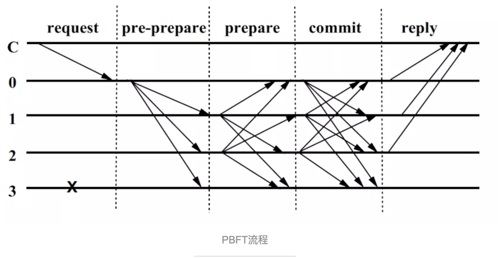

# 分布式架构遭遇的问题

分布式架构会遭遇到以下问题：
1. 异构环境的分布式架构首先可能遇到网络传输问题，比如数据丢失、延迟、重复、乱序。
2. 欺骗攻击和重播攻击
3. 操纵多个失效节点，延迟通讯，制造混乱。

具体到区块链世界，存在同样类似的问题：

区块链是一个分布式账本系统，参与者通过点对点网络连接，所有消息都通过广播的形式来 发送。系统中存在两种角色:普通节点和记账节点。普通节点使用系统来进行转账、交易等操作，并接受账本中的数据;记账节点负责向全网提供记账服务，并维护全局账本。 我们假设在此网络中，消息可能会丢失、损坏、延迟、重复发送，并且接受的顺序与发送的 顺序不一致。此外，节点的行为可以是任意的:可以随时加入、退出网络，可以丢弃消息、 伪造消息、停止工作等，还可能发生各种人为或非人为的故障。

其实这就是拜占庭将军问题。

# 实用拜占庭容错算法PBFT（Practical Byzantine Fault Tolerance）

为了解决节点故障可能造成对系统的危害，PBFT采用了一种比较简洁的办法。

首先借用一个类比：

PBFT算法要求至少要4个参与者，一个被选举为军长，3个师长。军长接到总司令命令：你们向前行军500公里。军长就会给3个师长发命令向前行军500公里。3个师长收到消息后会执行命令，并汇报结果。A师长说我在首都以东500公里，B师长说我在首都以东500公里，C师长说我在首都以东250公里。军长总结3个师长的汇报，发现首都以东500公里占多数（2票>1票），所以就会忽略C师长的汇报结果，给总司令汇报说，好了，现在部队是在首都以东500公里了。这就是PBFT算法。

PBFT算法的核心理论是n>=3f+1

n是系统中的总节点数，f是允许出现故障的节点数。换句话说，如果这个系统允许出现f个故障，那么这个系统必须包括n个节点，才能解决故障。

# 5个概念

- client：请求（request）自愿者，上例中指总司令。
- replica：副本，所有参与提供服务的节点，上例指军长和师长
- primary：承担起提供服务主要职责的节点，上例是军长
- backup：其他副本，但相对于primary角色。上例指师长。
- view：处于存在primary-bakup场景中的相对稳定的关系，叫视图。
- 如果primary出现故障，这种相对稳定的视图关系就会转变（transit）。比如军长叛逃（出现故障，对外表现为不可见），那么某个师长就会转变成为军长。系统也就从视图a转变为视图b（a,b均为整数）。

# 4个阶段

- request：client请求阶段（有些说法不包括这个阶段）。总司令给军长下命令。
- 预准备（pre-prepare）：主节点向所有backup节点发送预准备消息，其中包括当前视图编号，client请求以及请求摘要，签名是否一致等。军长对各位师长说：现在是我的时代（视图），我是军长，你们都是师长，所有人都得听我的。现在公布总司令的命令（先说说总司令是谁，命令摘要）。
- 准备(prepare)：包括主节点在内的所有副本节点在收到准备消息之后，对消息的签名是否正确，视图编号是否一致，以及消息序号是否满足水线限制这三个条件进行验证，如果验证通过则把这个准备消息写入消息日志中。backup节点核对签名信息，比如其他师长听到总司令的名字，说对，总司令就是这个人没错，然后核对总司令曾经任命这家伙当军长，好吧，那就听他的吧。
- 确认(commit)：每个副本接受确认消息的条件是：1）签名正确；2）消息的视图编号与节点的当前视图编号一致；3）消息的序号n满足水线条件，在h和H之间。一旦确认消息的接受条件满足了，则该副本节点将确认消息写入消息日志中。每个师长都经过上述核对，确认无误，就会接受命令进行执行。
- 回复（reply）：结果反馈。

>预准备和准备两个阶段用来确保同一个视图中请求发送的时序性（即使对请求进行排序的主节点失效了），准备和确认两个阶段用来确保在不同的视图之间的确认请求是严格排序的。

# 非主节点失效的例子

下图展示了在没有发生主节点失效的情况下算法的正常执行流程，其中副本0是主节点，副本3是失效节点，而C是客户端。通过这个例子，也帮助我们理解n>=3f+1的算法。

简单再回顾一下：
1. 总司令给军长下命令向前行军500公里；
2. 军长将消息（不只有命令）传递给所有师长；
3. 1号2号师长又把消息传给其他师长，3号师长处于叛逃状态；
4. 军长再次询问各位师长是否同意执行命令。
5. 所有军官（包括军长和师长）向总司令汇报结果。
