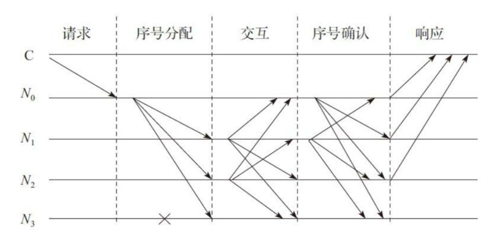

# 由来

原始的拜占庭容错系统由于需要展示理论上的可行性而缺乏实用性。另外，算法的复杂度也是随节点的增加而呈指数级增加。实用拜占庭容错系统（Practical Byzantine Fault Tolerance, PBFT）降低了拜占庭协议的运行复杂度，从指数级别降低到多项式级别，使拜占庭协议在分布式系统中应用成为可能。

# 什么是实用拜占庭容错系统

实用拜占庭容错系统是一类“状态机”拜占庭系统（这里的状态机可以理解为“系统状态”，以区块链记账为例，系统每新增一个区块，账本就更新到一个新的状态。前面讲过，拜占庭容错系统是一个强一致性协议，每次记账后系统都会达成新的状态。），要求系统所有节点共同维护一个状态，所有节点采取的行动一致。

实用拜占庭容错系统需要运行三类基本协议：

* 一致性协议：解决如何达成共识
* 检查点协议：类似于操作系统的还原点
* 视图更换协议：系统的每个服务器节点在同样的配置信息下工作，该配置信息被称为“视图”。配置信息由主节点确定，主节点更换，视图也随之变化。

我们主要关注支持系统日常运行的一致性协议。

# PBFT 的 一致性协议

一致性协议至少包含请求（request）、序号分配（pre-prepare）、响应（reply）三个阶段。根据协议设计的不同，可能包含相互交互(prepare) 、序号确认(commit)等阶段。

PBFT系统通常假设故障节点个数为m个，而整个服务节点数为3m+1个。



上图显示了一个简化的 PBFT 的协议通信模式，其中C为客户端，N0~N3为服务节点，N0为主节点，N3为故障节点。协议的节本过程如下：

1. Request：客户端发送请求，激活主节点的服务操作
2. 当主节点接收请求后，启动三阶段的协议以向各从节点广播请求
    * Pre-Prepare：主节点给请求赋值一个序列号n，广播序号分配消息和请求消息，并构造PRE-PREPARE消息给各从节点
    * Prepare：从节点接收PRE-PREPARE消息，并向其他服务节点广播PREPARE消息
    * Commit：各节点对视图内的请求和次序进行验证后，广播COMMIT消息，执行收到的客户端的请求并给客户端以响应
3. Reply：客户端等待来自不同节点的响应，若有m+1个响应相同，则该响应即为运算的结果

# PBFT 演示

在 n ≥ 3m + 1 的情況下一致性是可能解決的，其中，n为总节点数，m为恶意节点总数。我们模拟一下PBFT：
n = 4, m = 0

节点 | 得到数据 | 最终结果
----|----------|--------
A | 1111 | 1
B | 1111 | 1
C | 1111 | 1
D | 1111 | 1

n = 4, m = 1

节点 | 得到数据 | 最终结果
----|----------|---------
A | 1110 | 1
B | 1101 | 1
C | 1011 | 1
D | 0111 | 1

n = 4，m = 2


节点 | 得到数据 | 最终结果
-----|---------|--------
A | 1100 | 1
B |	1001 | 1
C |	0011 | 1
D |	0110 | 1

# go 实现简单PBFT

## 编译

```
go build main.go
```

## 测试

新打开 5 个终端

```sh
./main Apple

./main MS

./main Google

./main IBM

curl -H "Content-Type: applicaton/json" -X POST -d '{"clientID":"ahnhwi","operation":"GetMyName","timestamp":859381532}' http://localhost:1111/req
```
